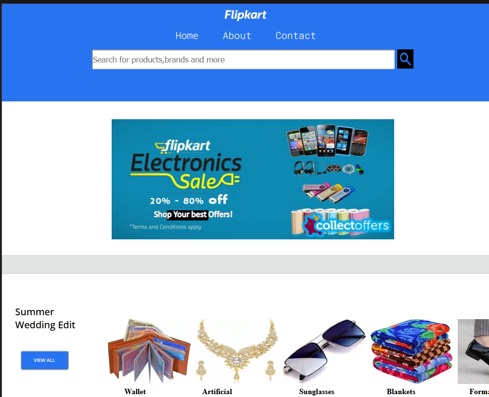

# Flipkart Clone 

Welcome to the Flipkart project! This is a simple Online Shopping website which becomes in use now-a-days.

## Table of Contents
- [Project Overview](#projectOverview)
- [Features](#features)
- [Screenshots](#demo)
- [Getting Started](#getting-started)
- [Project Structure](#project-Structure)

## Project Overview
In this project, I aim to replicate the basic structure and design of the Flipkart website using HTML for the content and CSS for styling. Please note that this clone is for educational purposes and does not have the full functionality of the actual Flipkart website.
## Features

- Homepage clone with product listings
- Product detail pages
- Basic styling to match Flipkart's design
- Responsive design for different screen sizes
- Scrollable Banner Images provides at top of body...

## Screenshots
- Mobile Flexibility


- iPad Flexibility


- FullScreen Flexibility


## Getting Started

Follow these instructions to get a copy of the project up and running on your local machine.

1. **Clone the repository**

   ```bash
   git clone https://github.com/vaishnavi-3969/Web-Componentify.git
   ```

2. **Open index.html in your preferred browser**

   Simply open the `index.html` file in your web browser.

## Project-Structure

flipkart-clone/
- ── index.html
- ── css/
   ├── style.css
   └── (other CSS files)
- ── (image assets)
- ── README.md


